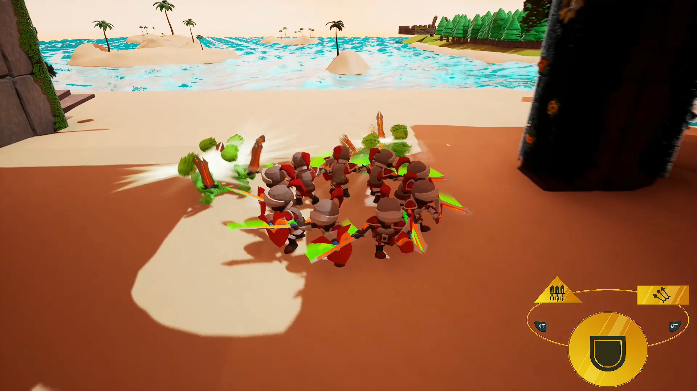
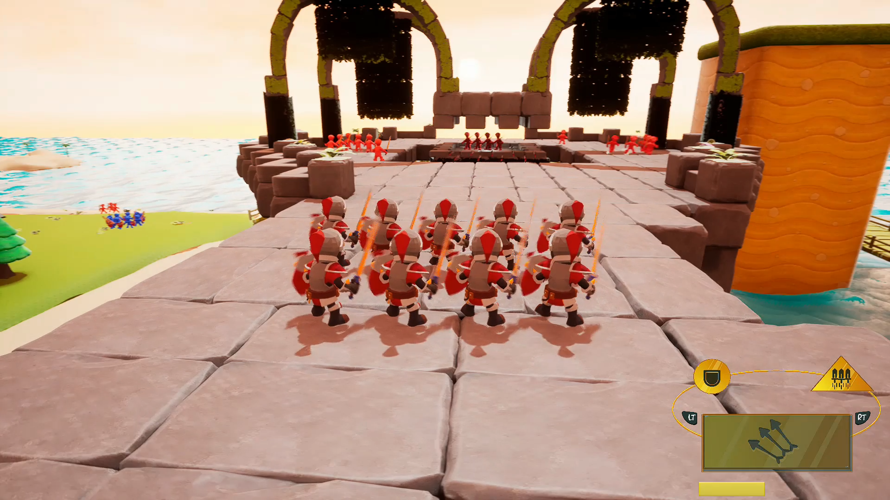
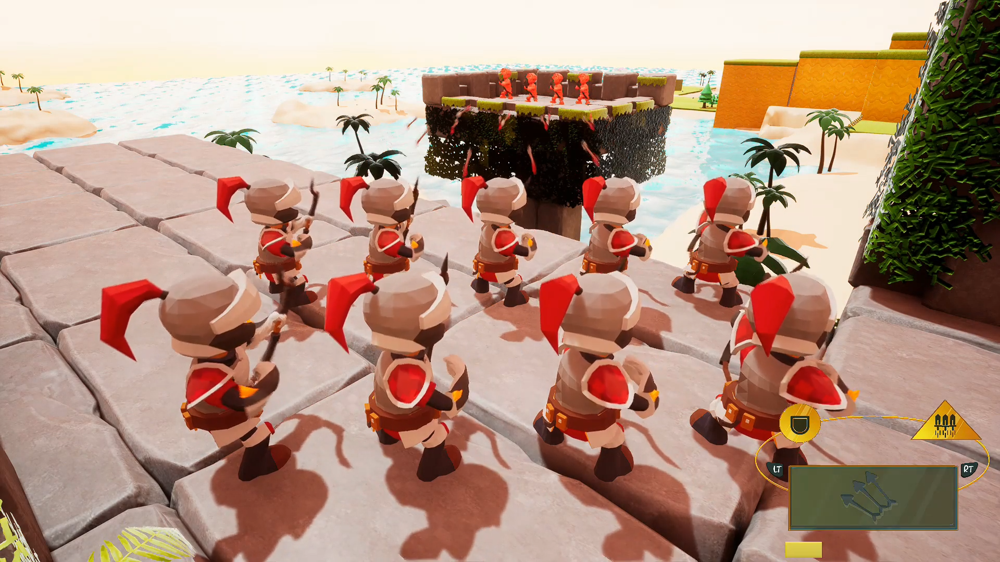
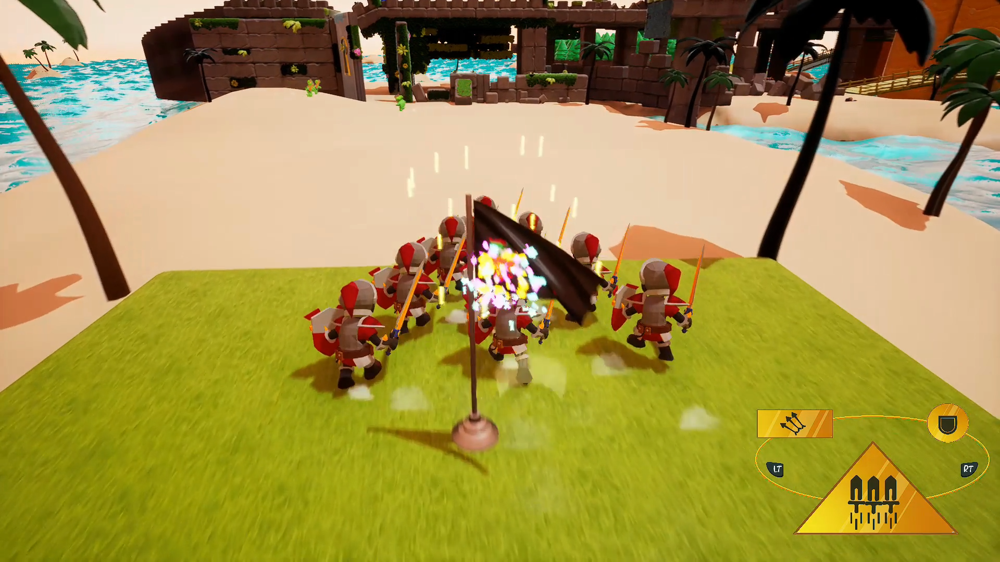
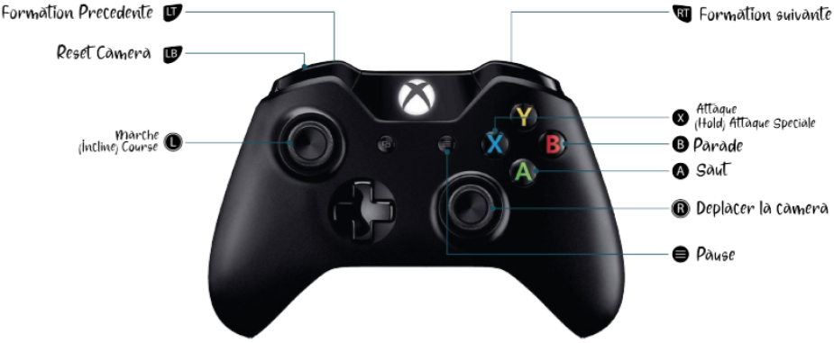

# Mini Company

    

         

    <a href="https://www.youtube.com/watch?v=oyDPEQYcDxI"> Gameplay footage</a>

## Description
Mini Company is a single player third-person brawler game.  
Play as a group of 9 brave, and totally competent, knights in their journey to save an island from the invasion of evil knight.
Defeat the enemies by assuming 3 different formation!

## Controls
Mini Company is meant to be played on gamepad

## Controls
Gamepad:
| Input                 | Action                |
|-----------------------|-----------------------|
| Left face button      | Attack                |
| Right face button     | Block                 |
| Bottom face button    | Jump                  |
| Top face button       | Special attack        |
| Left joystick         | Move company          |
| Right joystick        | Move camera           |
| Left trigger          | Previous formation    |
| Right trigger         | Next formation        |
| Right shoulder        | Lock camera           |
| Select Button		    | Get out of lobby	    |

Keyboard (Qwerty):
| Input                 | Action                |
|-----------------------|-----------------------|
| Left Mouse Button     | Attack                |
| Right Mouse Button    | Block                 |
| Space Bar             | Jump                  |
| Right Mouse Button    | Special attack        |
| WASD Keys             | Move company          |
| Mouse                 | Move camera           |
| Q Key                 | Previous formation    |
| E Key                 | Next formation        |
| Enter Key		        | Get out of lobby	    |

## Credits
| Game Designer
|---------------------------|
| AYRAL Malo                |
| JALLIFFIER-MERLON Jules   |
| LECACHEUR Anthony         |

| Game Programmer
|---------------------------|
| AMARA Sami                |
| PETIT Denis               |
